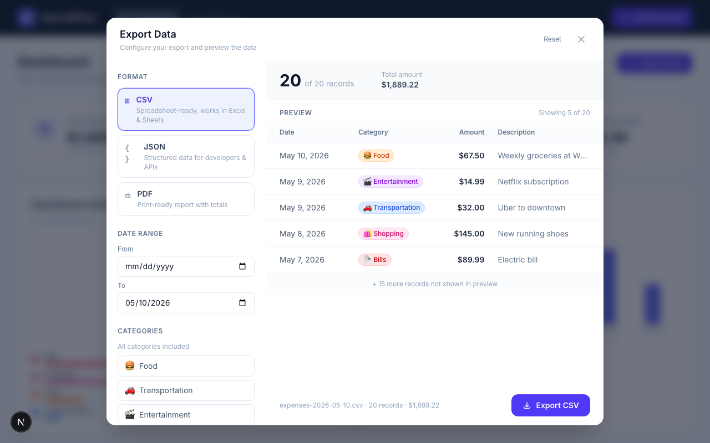
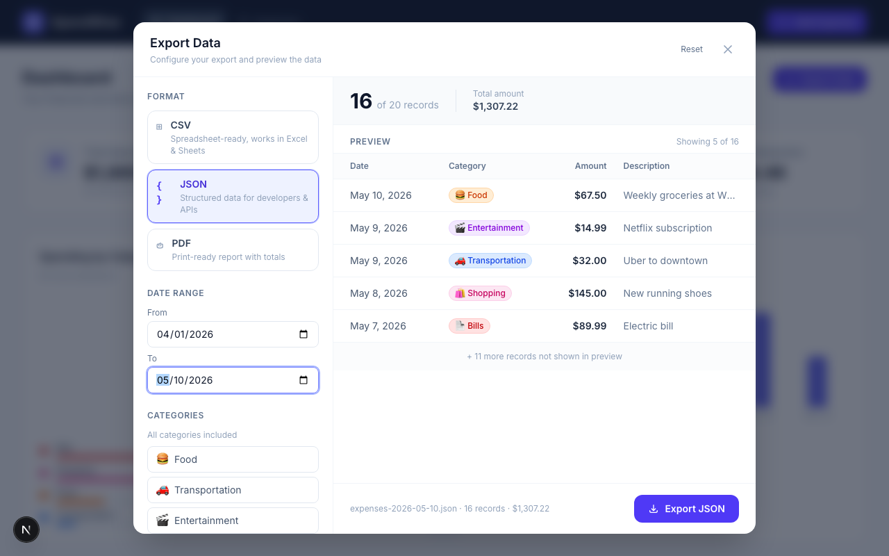
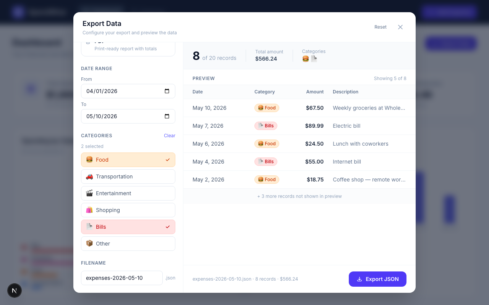

# How to Export Your Expenses

SpendWise lets you export your expense data at any time. You can choose the file format, filter by date range or category, preview what you're about to download, and set a custom filename — all before a single file is created.

---

## Opening the Export Dialog

Click the **Export Data** button in the top-right corner of the dashboard.

```
Dashboard                                    [ Export Data ]
Your financial overview at a glance
```

A dialog will open with a configuration panel on the left and a live preview on the right.



---

## Step 1 — Choose a Format

Three formats are available:

| Format | Best for |
|---|---|
| **CSV** | Opening in Excel, Google Sheets, or any spreadsheet app |
| **JSON** | Importing into another app, writing scripts, or developer use |
| **PDF** | Printing or saving a formatted report |

Click any format card to select it. The export button at the bottom will update to show the chosen format (e.g., **Export CSV**).

---

## Step 2 — Filter Your Data (Optional)

By default, all expenses are included. You can narrow the export using two filters:

### Date Range

Set a **From** and/or **To** date to include only expenses within that period.

- Leave **From** empty to include everything up to the To date.
- Leave **To** empty to include everything from the From date onwards.
- Leave both empty to export all expenses regardless of date.



### Categories

Click any category to include only expenses in that category. You can select multiple categories.

- When no categories are selected, **all categories are included**.
- Selected categories are highlighted in their respective colours.
- Click **Clear** (appears when at least one category is selected) to deselect all.



---

## Step 3 — Preview Your Data

The right side of the dialog shows a live preview that updates as you change filters:

- **Record count** — how many expenses match your current filters (shown as "X of Y records")
- **Total amount** — the sum of all matching expenses
- **Preview table** — the first 5 matching rows, showing Date, Category, Amount, and Description
- If more than 5 records match, a note below the table shows how many additional records will be included in the actual file

If no records match your filters, the preview shows an empty state and the export button is disabled.

---

## Step 4 — Set a Filename (Optional)

The filename field at the bottom of the left panel defaults to `expenses-YYYY-MM-DD` (today's date). You can change it to anything you like.

The file extension (`.csv`, `.json`) is added automatically and shown next to the input field — you don't need to type it.

---

## Step 5 — Export

Click the **Export [FORMAT]** button in the bottom-right corner.

- The button shows a spinner and "Exporting…" briefly while the file is prepared.
- Once complete, the button turns green and shows "Exported!" — your file has been saved to your Downloads folder (or wherever your browser saves downloads).
- After 2.5 seconds, the button returns to normal. You can export again immediately with different settings if needed.

The dialog stays open after an export so you can make adjustments and export again without re-opening it.

---

## Resetting Filters

Click **Reset** (top-right of the dialog) to restore all settings to their defaults:
- Format: CSV
- Date range: cleared (all dates)
- Categories: cleared (all categories)
- Filename: `expenses-{today}`

---

## Closing the Dialog

Close the dialog by:
- Clicking the **×** button in the top-right corner
- Clicking anywhere on the dark background outside the dialog
- Pressing the **Escape** key

---

## What Each Format Contains

### CSV

A plain-text spreadsheet file with one expense per row:

```
Date,Category,Amount,Description
2024-01-15,Food,12.50,Lunch at Pret
2024-01-18,Transportation,3.20,Bus fare
```

Open it directly in Excel or Google Sheets. Commas inside descriptions are automatically handled.

### JSON

A structured data file, useful for importing into other tools or writing scripts:

```json
[
  {
    "date": "2024-01-15",
    "category": "Food",
    "amount": 12.50,
    "description": "Lunch at Pret"
  }
]
```

### PDF

Opens a new browser tab with a formatted expense report, then shows the print dialog. From there you can:
- Print to paper
- Save as PDF using your browser's "Save as PDF" printer option

The report includes all selected expenses and a grand total row at the bottom.

> **Note:** Some browsers block new tabs from opening automatically. If the PDF report does not appear, look for a pop-up blocked notification in your browser's address bar and allow the page to open it.

---

## Frequently Asked Questions

**Does exporting affect my data in any way?**
No. Exporting is read-only. Your expenses in SpendWise are not changed, moved, or deleted when you export.

**Where is the file saved?**
To your browser's default download location — usually your Downloads folder. You can change the default download location in your browser settings.

**Can I export the same data multiple times?**
Yes. You can export as many times as you like, in any format, with any filters.

**I filtered by date but the wrong records are showing — what's happening?**
Check that your dates are entered in the correct order (From should be earlier than To). If the From date is later than the To date, no records will match and the export button will be disabled.

**The PDF option isn't downloading a file — it opened a print dialog instead. Is that normal?**
Yes. For PDF, the browser's built-in print dialog is used. Choose "Save as PDF" (or "Microsoft Print to PDF" on Windows) as the printer to save a PDF file to your computer.

**Can I export only some categories?**
Yes — click the category buttons in the Categories section to select only the ones you want. The preview updates instantly so you can see exactly what will be exported before downloading.
